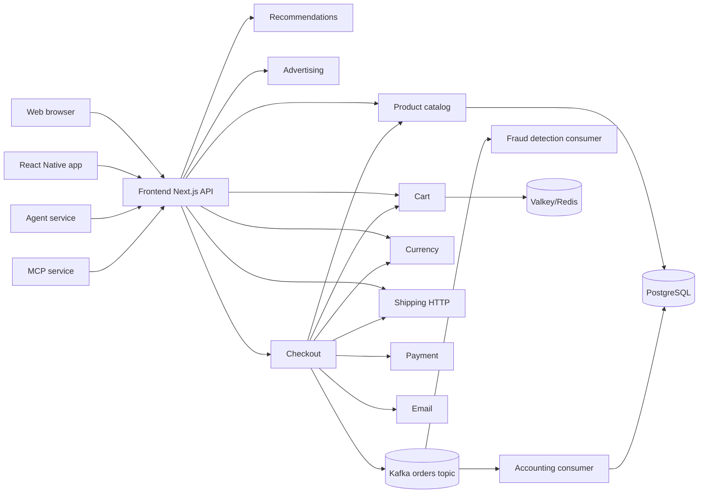
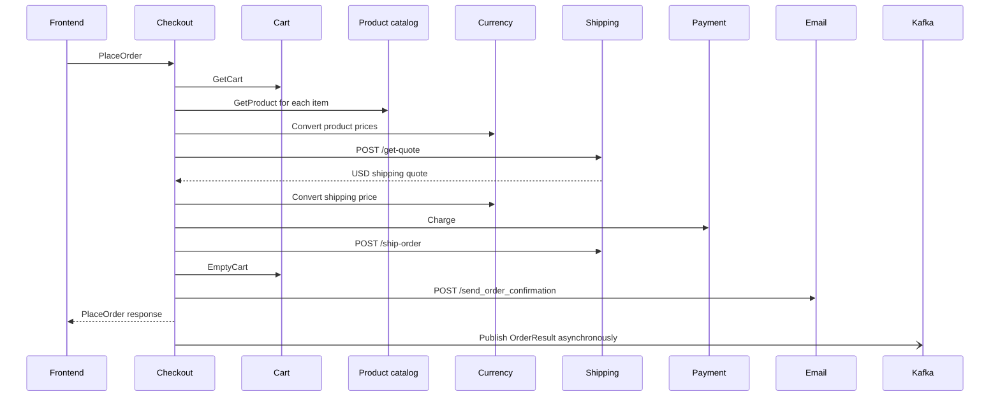

# Developer-to-DevOps Handoff

This document describes the application behavior implemented under `src/`. It is a developer handoff for operating, monitoring, and troubleshooting the application. It intentionally does not describe Dockerfiles, Compose, Kubernetes, Helm, Terraform, CI/CD, deployment topology, or other infrastructure configuration.

Where the application source does not establish a fact, this document says: **Not determined from the source code.**

## 1. Application Overview

The application is the OpenTelemetry Astronomy Shop demo: a web storefront and companion mobile application for browsing astronomy products, managing a cart, calculating shipping, changing currencies, and completing orders.

The web frontend is a Next.js application. Its browser-facing API routes provide a JSON/HTTP facade over backend gRPC services and a small number of HTTP services. The backend is intentionally polyglot: Go, C#, C++, Java, Kotlin, Rust, Python, Ruby, PHP, TypeScript, and Elixir code are present.

The main business path is synchronous through the frontend and backend services. Completed orders are also serialized and published to Kafka for asynchronous accounting and fraud-detection consumers.

## 2. Shared Protocol Contract

The shared protobuf contract is `pb/demo.proto`; generated copies are used by individual services. The application source defines these RPC services:

| Service                 | RPCs                                           | Implementation                                                                                                        |
| ----------------------- | ---------------------------------------------- | --------------------------------------------------------------------------------------------------------------------- |
| `CartService`           | `AddItem`, `GetCart`, `EmptyCart`              | `src/cart/src/services/CartService.cs`                                                                                |
| `ProductCatalogService` | `ListProducts`, `GetProduct`, `SearchProducts` | `src/product-catalog/main.go`                                                                                         |
| `RecommendationService` | `ListRecommendations`                          | `src/recommendation/recommendation_server.py`                                                                         |
| `CurrencyService`       | `GetSupportedCurrencies`, `Convert`            | `src/currency/src/server.cpp`                                                                                         |
| `AdService`             | `GetAds`                                       | `src/ad/src/main/java/oteldemo/AdService.java`                                                                        |
| `CheckoutService`       | `PlaceOrder`                                   | `src/checkout/main.go`                                                                                                |
| `PaymentService`        | `Charge`                                       | `src/payment/index.js`                                                                                                |
| `ShippingService`       | `GetQuote`, `ShipOrder`                        | HTTP implementation is used by the application; the exact gRPC server mapping is not determined from the source code. |
| `EmailService`          | `SendOrderConfirmation`                        | HTTP implementation is in `src/email/email_server.rb`; exact RPC exposure is not determined from the source code.     |
| `FeatureFlagService`    | Flag CRUD operations                           | No handwritten implementation was found in the inspected application source.                                          |

Generated protobuf code is an implementation artifact, not an additional business service.

## 3. Frontend Service

### Responsibility

The frontend renders the Astronomy Shop UI and exposes the browser-facing API. It coordinates backend calls, enriches product data with converted prices, and converts protobuf responses into JSON responses for the browser.

The frontend also owns the browser session identifier and propagates it as OpenTelemetry baggage. The web session is stored by `Session.gateway.ts`; the default currency is USD.

### HTTP API

All routes are implemented under `src/frontend/pages/api` and return `405` for unsupported methods.

| Method   | Path                       | Behavior                                                                                             |
| -------- | -------------------------- | ---------------------------------------------------------------------------------------------------- |
| `GET`    | `/api/products`            | Lists catalog products; `currencyCode` is optional and defaults in the service path to USD.          |
| `GET`    | `/api/products/:productId` | Gets one catalog product, with optional currency conversion.                                         |
| `GET`    | `/api/cart`                | Reads the cart by `sessionId`, then fetches product details for every cart item.                     |
| `POST`   | `/api/cart`                | Adds an item, then reads and returns the cart. Body contains `userId` and `item`.                    |
| `DELETE` | `/api/cart`                | Empties the cart using `userId`; returns `204`.                                                      |
| `GET`    | `/api/currency`            | Returns supported currency codes.                                                                    |
| `GET`    | `/api/data`                | Returns ads for `contextKeys`.                                                                       |
| `GET`    | `/api/recommendations`     | Requests recommendation IDs and resolves at most four IDs into product details.                      |
| `GET`    | `/api/shipping`            | Parses `itemList` and `address` query JSON, obtains a USD quote, then converts it to `currencyCode`. |
| `POST`   | `/api/checkout`            | Places an order, then enriches returned order items with catalog product details.                    |

The frontend gRPC client addresses are read in module initialization from `CART_ADDR`, `PRODUCT_CATALOG_ADDR`, `CURRENCY_ADDR`, `RECOMMENDATION_ADDR`, `AD_ADDR`, and `CHECKOUT_ADDR`. The shipping HTTP client reads `SHIPPING_ADDR`.

### Backend calls

- Products call `ProductCatalogService.ListProducts` or `GetProduct`. For a non-USD currency, each price is converted through `CurrencyService.Convert`.
- Cart calls `CartService`. Cart reads then call the catalog for each item so the JSON response includes full product data.
- Recommendations call `RecommendationService`, then call the catalog for up to four returned IDs.
- Ads call `AdService.GetAds`.
- Currency calls `CurrencyService`.
- Shipping calls `POST /get-quote` on shipping, then calls `CurrencyService.Convert` on the returned USD cost.
- Checkout calls `CheckoutService.PlaceOrder`, then calls the catalog for each returned order item.

### Frontend failure behavior

The API handlers generally do not catch downstream exceptions. gRPC errors, HTTP failures, malformed query JSON, and catalog enrichment failures therefore become framework-level request failures, normally HTTP 500 responses.

`/api/shipping` uses `JSON.parse` directly for `itemList` and `address`; malformed values fail before the shipping request is made. The frontend instrumentation middleware records exceptions and marks the current span as an error.

No frontend readiness or liveness endpoint is implemented in the inspected application source. **Not determined from the source code** whether the Next.js process has an additional framework-provided health route outside the inspected API source.

## 4. Product Catalog

**Source:** `src/product-catalog/main.go`

The catalog is a gRPC service backed by PostgreSQL. It implements listing, individual lookup, and search. It reads product records from `catalog.products`; categories are stored as comma-delimited text and returned as arrays.

Important behavior:

- `ListProducts` returns catalog products.
- `GetProduct` returns one product or a not-found gRPC error.
- `SearchProducts` searches the catalog according to the implementation in the service.
- Database connection and query failures become gRPC internal errors.
- Feature flags can force product-specific failures.
- OpenTelemetry SQL instrumentation, traces, metrics, and logs are configured in application code.
- The service registers standard gRPC health. Its source-level health response is `SERVING`; `Watch` is not implemented.

Configuration read by the service includes `DB_CONNECTION_STRING` and a service port variable. The exact default port is **Not determined from the source code**.

## 5. Cart

**Source:** `src/cart/src/Program.cs`, `src/cart/src/services/CartService.cs`, `src/cart/src/cartstore/ValkeyCartStore.cs`

The cart is a gRPC service backed by Valkey/Redis. It implements:

- `AddItem(userId, item)`
- `GetCart(userId)`
- `EmptyCart(userId)`

Cart records are stored as protobuf data in Valkey/Redis. The store applies a 60-minute expiration to cart records.

`VALKEY_ADDR` is required at startup. The application initializes the store and terminates if this configuration is missing. Redis/Valkey failures are returned as gRPC failures and are recorded by the service instrumentation.

The application registers gRPC health checks. The readiness check is controlled by the OpenFeature flag `failedReadinessProbe`; it is a deliberate feature-flag switch, not a direct Valkey connectivity check. The `cartFailure` flag can route empty-cart operations to an intentionally invalid store.

The root HTTP route only returns a message explaining that communication must use gRPC. It is not a business HTTP API.

## 6. Checkout

**Source:** `src/checkout/main.go`, `src/checkout/kafka/producer.go`

Checkout implements `CheckoutService.PlaceOrder`. It is the main synchronous order coordinator.

### Order flow

The implementation reads the cart, resolves product data and prices, obtains and converts shipping, charges payment, requests shipment, empties the cart, sends confirmation email, and publishes the completed order when Kafka is configured.

The main dependencies are configured with `SHIPPING_ADDR`, `PRODUCT_CATALOG_ADDR`, `CART_ADDR`, `CURRENCY_ADDR`, `EMAIL_ADDR`, and `PAYMENT_ADDR`. Kafka configuration uses `KAFKA_ADDR` and `KAFKA_TOPIC`; the topic defaults to `orders` in the producer implementation.

Application-specific failure behavior:

- Cart, catalog, currency, payment, and order-ID failures fail checkout.
- Shipping failures are returned as checkout failures, generally unavailable/internal gRPC errors depending on the path.
- Email failure is logged but intentionally does not fail the order.
- Cart-empty failure after shipping is ignored by the implementation, so an order can complete while the cart remains populated.
- Kafka publication is asynchronous. Producer errors are logged and do not roll back the order. The producer uses no-response acknowledgements, so a broker-side publication failure may not be observable as a synchronous checkout failure.
- Feature flags can make payment unreachable and can deliberately stress Kafka.

Checkout registers standard gRPC health. The source returns `SERVING` for health checks; `Watch` is not implemented.

## 7. Shipping and Quote Services

### Shipping

**Source:** `src/shipping/src/main.rs`, `src/shipping/src/shipping_service.rs`

Shipping is an Actix HTTP service with these routes:

- `GET /health`: returns HTTP 200 with an empty body.
- `POST /get-quote`: calculates a quote from submitted items/address.
- `POST /ship-order`: generates a tracking identifier and returns shipment information.

The service requires `SHIPPING_PORT`. `IPV6_ENABLED=true` changes the bind address to IPv6. OpenFeature/flagd is initialized at startup; startup fails if the port is absent/invalid, OpenTelemetry initialization fails, or the flag provider cannot initialize.

Quote and shipping errors become HTTP 500 responses. The `/health` route always returns 200 and does not prove that the quote dependency is available.

The source references the quote helper/service. The exact network boundary and all request/response details between shipping and quote are **Not determined from the source code**.

### Quote

**Source:** `src/quote/public/index.php`, `src/quote/app/routes.php`

Quote exposes `POST /getquote`. Its application route expects a parsed body containing `numberOfItems` and calculates:

$$quote = round(8.99 \times numberOfItems, 2)$$

It creates an OpenTelemetry span named `calculate-quote`, records an item-count attribute and total-cost attribute, increments a `quotes` counter, and logs `Calculated quote` with the total.

An invalid or missing `numberOfItems` is recorded on the span. Because the function returns the initialized quote from a `finally` block, the source returns the default `0.0` on that error path instead of propagating the exception. The exact HTTP server health behavior and failure status mapping are **Not determined from the source code**.

The frontend shipping gateway sends item and address objects using `/get-quote`; its exact adapter to the quote route is **Not determined from the source code**.

## 8. Currency

**Source:** `src/currency/src/server.cpp`

Currency implements `CurrencyService.GetSupportedCurrencies` and `Convert`. Conversion uses an in-memory conversion table; no database, queue, or durable storage is evident in the application source.

Invalid currency requests and conversion errors are returned through gRPC status responses. The exact supported currency list, conversion table values, and status-code mapping are **Not determined from the source code**.

The service exposes standard gRPC health. Its source-level health behavior reports `SERVING`.

## 9. Payment

**Source:** `src/payment/index.js`, `src/payment/charge.js`

Payment implements `PaymentService.Charge`. It is synthetic: it validates payment information and generates a UUID transaction ID, but the source does not call an external payment processor or persist charges.

Validation includes card number, card type, and expiration. Visa and Mastercard are accepted; unsupported card types, invalid cards, expired cards, and feature-flag-induced failures become gRPC errors.

The service requires `PAYMENT_PORT` and supports `IPV6_ENABLED`. It exposes standard gRPC health and reports `SERVING`.

Logs include transaction metadata such as card type, last four digits, amount, and transaction ID. Operators should still treat payment logs as sensitive because order/payment metadata is present even though the full card number is not logged by the application path inspected.

## 10. Email

**Source:** `src/email/email_server.rb`, `src/email/views/confirmation.erb`

Email exposes `POST /send_order_confirmation`. It renders the order confirmation using the ERB template and uses the Ruby mailer implementation in the service.

No durable email queue, SMTP provider, or persistent email store is established by the inspected application source. Exact delivery behavior, retry behavior, health endpoint, and HTTP response mapping are **Not determined from the source code**.

Checkout treats email failure as non-fatal and logs the failure after the order has otherwise completed.

## 11. Recommendations

**Source:** `src/recommendation/recommendation_server.py`

Recommendations implements `RecommendationService.ListRecommendations`. It calls the product catalog, excludes the requested product IDs, randomly selects up to five products, and returns their IDs.

The service uses OpenTelemetry traces, metrics, and logs. It reads `OTEL_SERVICE_NAME`, `PRODUCT_CATALOG_ADDR`, and optional flagd settings including `FLAGD_HOST` and `FLAGD_PORT`.

The `recommendationCacheFailure` feature flag enables an intentionally unbounded in-memory cache behavior. Catalog connectivity failures and malformed catalog responses are the primary application failures.

Standard gRPC health is registered and reports `SERVING`; `Watch` is not implemented.

## 12. Advertising

**Source:** `src/ad/src/main/java/oteldemo/AdService.java`

Ads implements `AdService.GetAds`. Advertisements are held in memory. Context keys select targeted ads by category; requests without context keys receive a random response. At most two ads are served per request.

The service requires `AD_PORT`. It exposes an additional Prometheus client endpoint on `AD_PROMETHEUS_PORT`, defaulting in source to `9465`, at `/metrics`. It also exposes standard gRPC health.

Feature flags can trigger ad failures, manual garbage collection, and high CPU load. Ad failures are logged, recorded on the current span, and returned as gRPC `UNAVAILABLE` behavior in the implementation.

There is no database, queue, or durable ad store.

## 13. Accounting Worker

**Source:** `src/accounting/Program.cs`, `src/accounting/Consumer.cs`, `src/accounting/Entities.cs`

Accounting is a background Kafka consumer, not an HTTP or gRPC request service. It consumes serialized `OrderResult` messages from the orders topic and persists completed-order accounting data to PostgreSQL through Entity Framework.

Persisted data includes orders, order items, shipping cost, and shipping address. `DB_CONNECTION_STRING` configures PostgreSQL; Kafka settings are read from `KAFKA_*` variables.

Duplicate order IDs are detected through PostgreSQL unique-violation handling and skipped. Protobuf parsing, database, and message-processing errors are logged. No retry queue or dead-letter behavior is evident in the inspected source. No application health endpoint is exposed.

If the database connection string is missing, the source skips persistence. The exact consumer retry/commit timing is **Not determined from the source code**.

## 14. Fraud Detection Worker

**Source:** `src/fraud-detection/src/main/kotlin/frauddetection/main.kt`

Fraud detection consumes the Kafka `orders` topic using consumer group `fraud-detection`. It reads serialized `OrderResult` messages and logs consumed order IDs. The inspected source does not emit a fraud decision, persist a fraud case, or call another service.

`KAFKA_ADDR` is required and `KAFKA_TOPIC` defaults to `orders`. The consumer uses `auto.offset.reset=earliest`. The `kafkaQueueProblems` feature flag can delay processing by one second per message.

No HTTP/gRPC health endpoint or durable database is evident. Broker, deserialization, and consumer failures are not locally recovered in the inspected source.

## 15. Agent Service

**Source:** `src/agent/run.py`, `src/agent/src/agents/agents.py`, `src/agent/src/agents/llm.py`

Agent exposes `POST /prompt` with a body containing `message` and optional `history`. It runs a LangChain/LangGraph ReAct-style agent with a concise/helpful system prompt.

The agent can use built-in shop tools or load equivalent tools from MCP:

- list products and get product details
- get ads
- get recommendations
- read/add/empty carts
- checkout
- list supported currencies
- get shipping quotes

Built-in tools call the frontend through `APPLICATION_ENDPOINT`. MCP mode connects to `http://${MCP_ENDPOINT}:${MCP_PORT}/mcp`; when enabled, dynamically loaded MCP tools replace the built-in list.

Configuration includes `AGENT_PORT`, `GRAPH_RECURSION_LIMIT`, `APPLICATION_ENDPOINT`, `MCP_ENABLED`, `MCP_ENDPOINT`, `MCP_PORT`, `LLM_BASE_URL`, `LLM_MODEL`, `API_KEY`, `LLM_TLS_VERIFY`, `USE_VCR`, and `VCR_MATCH_THRESHOLD`.

The LLM client is OpenAI-compatible. VCR mode records/replays normalized HTTP interactions from model-specific cassettes. Agent exceptions become HTTP 500 responses containing the exception text. No health endpoint is present in the inspected source.

## 16. MCP Service

**Source:** `src/mcp/run.py`, `src/mcp/src/mcp_server/astronomy_shop_mcp_server.py`

MCP exposes the shop operations over streamable HTTP at `/mcp`. The service uses `MCP_PORT` and calls the frontend API through shared shop tools. It has no database, queue, or background business worker.

The service supports the same operation set as the agent's built-in tools. Tool failures are surfaced to the MCP client as tool-level failures/strings. An application health endpoint is **Not determined from the source code**.

The MCP client in Agent requires the MCP session to initialize successfully during application startup when `MCP_ENABLED=True`; MCP unavailability therefore prevents normal agent tool operation.

## 17. Chatbot

**Source:** `src/chatbot/run.py`, `src/chatbot/src/chat_interface/chat_interface.py`, and the OpAMP integration under `src/chatbot/src/opamp.py`

Chatbot is a separate conversational UI that sends user messages and conversation history to the Agent `/prompt` endpoint. Its HTTP routes are generated by the Gradio application rather than declared as ordinary handwritten route functions.

It supports OpenTelemetry instrumentation and an optional OpAMP client. The OpAMP client reports health/heartbeat state every 30 seconds when `OPAMP_SERVER_ENDPOINT` is configured. TLS verification can be disabled by `OPAMP_SERVER_TLS_INSECURE_SKIP_VERIFY`.

Exact externally exposed chatbot routes, port defaults, and all timeout defaults are **Not determined from the source code**. The source references `AGENT_ENDPOINT`, `AGENT_CHAT_INTERFACE_TIMEOUT`, `CHATBOT_ROOT_PATH`, and OpAMP variables.

## 18. React Native Application

**Source:** `src/react-native-app`

The React Native/Expo application is a second client for the same frontend API. It implements a subset of the web functionality: product browsing, cart operations, and checkout. Currency, recommendations, ads, and shipping-cost display are intentionally incomplete in the native client source; it hard-codes USD in the relevant provider paths.

The app stores its session and generated UUID in AsyncStorage. It reads or allows editing of the frontend proxy URL through its Settings screen. The configured endpoint is used for API requests and tracing.

This is a client application, not a backend microservice. It has no server-side database, queue, or health endpoint.

## 19. Load Generator

**Source:** `src/load-generator/script.js`, `src/load-generator/xk6-otel/otel.go`

The load generator is a k6-based synthetic client. It exercises storefront workflows including product listing, cart actions, recommendations, shipping, and checkout. It emits traces, metrics, and logs through the custom `k6/x/otel` extension.

It polls feature-flag state and restarts k6 when the configured virtual-user count changes. A flag-polling failure falls back to the last successful value. It uses `FLAGD_HOST` and `FLAGD_OFREP_PORT` in the application code.

It is traffic-generation code rather than a business microservice and does not own application data.

## 20. Persistence and Data Stores

| Store                   | Owner                        | Data/behavior                                                                                |
| ----------------------- | ---------------------------- | -------------------------------------------------------------------------------------------- |
| PostgreSQL              | Product catalog              | Product records in `catalog.products`; configured with `DB_CONNECTION_STRING`.               |
| PostgreSQL              | Accounting                   | Completed orders, items, shipping cost, and address; configured with `DB_CONNECTION_STRING`. |
| Valkey/Redis            | Cart                         | Per-user cart protobuf records with 60-minute expiry; configured with `VALKEY_ADDR`.         |
| Kafka                   | Checkout producer            | Serialized `OrderResult` messages on topic `orders` by default.                              |
| Kafka                   | Accounting and fraud workers | Asynchronous order consumption.                                                              |
| In-memory process state | Currency                     | Conversion table.                                                                            |
| In-memory process state | Ads                          | Ad catalog and selection state.                                                              |
| In-memory process state | Recommendations              | Recommendation cache and random selection.                                                   |
| VCR cassette files      | Agent                        | Optional normalized LLM request/response replay data.                                        |

No application-owned persistent database is evident for payment, email, shipping, quote, ads, currency, MCP, or Agent, except for Agent's optional VCR fixture files.

## 21. External Dependencies

The application makes these external or cross-service calls:

- PostgreSQL from product catalog and accounting.
- Valkey/Redis from cart.
- Kafka from checkout, accounting, and fraud detection.
- OpenAI-compatible LLM endpoint from Agent, configured by `LLM_BASE_URL` and authenticated by `API_KEY`.
- Frontend HTTP API from Agent built-in tools and MCP tools.
- MCP streamable HTTP endpoint from Agent when enabled.
- Quote service from the shipping path.
- Flagd/OpenFeature provider from cart, shipping, payment, ads, recommendations, email-related code, and load-generator paths.
- OpAMP endpoint from chatbot and selected .NET services when configured.

No real external payment processor is called by the payment service source.

## 22. Important Environment Variables

Only variables referenced by application source are listed here. Values and deployment-specific hostnames are intentionally omitted.

### Service ports and addresses

`FRONTEND_PORT`, `SHIPPING_PORT`, `QUOTE_PORT`, `EMAIL_PORT`, `PAYMENT_PORT`, `AD_PORT`, `AD_PROMETHEUS_PORT`, `RECOMMENDATION_PORT`, `PRODUCT_CATALOG_PORT`, `CHECKOUT_PORT`, `AGENT_PORT`, `MCP_PORT`, `CHATBOT_PORT`, `CART_ADDR`, `CHECKOUT_ADDR`, `CURRENCY_ADDR`, `PRODUCT_CATALOG_ADDR`, `RECOMMENDATION_ADDR`, `AD_ADDR`, `SHIPPING_ADDR`, `EMAIL_ADDR`, `PAYMENT_ADDR`, and `QUOTE_ADDR`.

Some services read a port without providing a useful application default. Whether a specific port is required or defaulted must be taken from that service's source entrypoint.

### Storage and messaging

`DB_CONNECTION_STRING`, `VALKEY_ADDR`, `KAFKA_ADDR`, and `KAFKA_TOPIC`.

### Feature flags

`FLAGD_HOST`, `FLAGD_PORT`, `FLAGD_TLS`, `FLAGD_OFREP_PORT`, and the flag names used by services, including `failedReadinessProbe`, `cartFailure`, `paymentFailure`, `recommendationCacheFailure`, `kafkaQueueProblems`, `adFailure`, `adManualGc`, and `adHighCpu`.

### Agent and LLM

`APPLICATION_ENDPOINT`, `AGENT_ENDPOINT`, `MCP_ENABLED`, `MCP_ENDPOINT`, `GRAPH_RECURSION_LIMIT`, `LLM_BASE_URL`, `LLM_MODEL`, `API_KEY`, `LLM_TLS_VERIFY`, `USE_VCR`, and `VCR_MATCH_THRESHOLD`.

### Runtime and control-plane integrations

`IPV6_ENABLED`, `OTEL_SERVICE_NAME`, `OTEL_EXPORTER_OTLP_ENDPOINT`, `OTEL_EXPORTER_OTLP_INSECURE`, `OTEL_RESOURCE_ATTRIBUTES`, `OPAMP_SERVER_ENDPOINT`, `OPAMP_SERVER_TLS_INSECURE_SKIP_VERIFY`, `AGENT_CHAT_INTERFACE_TIMEOUT`, and `CHATBOT_ROOT_PATH`.

The exact defaults for variables not stated in the service sections are **Not determined from the source code**.

## 23. Health Checks and Readiness

Application-defined health surfaces found in source:

- Shipping: `GET /health`, always returns HTTP 200.
- gRPC services: standard `grpc.health.v1.Health/Check` is registered by cart, checkout, product catalog, currency, payment, recommendations, and ads. Several implementations return `SERVING` without checking all downstream dependencies.
- Cart: readiness is feature-flag controlled by `failedReadinessProbe`; it is not a live Valkey connectivity test.
- Ads: gRPC health is marked serving after startup; `/metrics` is a metrics endpoint, not a health endpoint.
- Agent: no application health endpoint found.
- MCP: no application health endpoint determined.
- Accounting and fraud detection: no HTTP/gRPC health endpoint found.
- Frontend: no application readiness endpoint found.

Health status therefore does not always prove dependency health. For operational diagnosis, pair health results with service error logs, dependency request failures, database/Kafka/Valkey connectivity, and request telemetry.

## 24. Logs, Metrics, and Traces

Most services initialize OpenTelemetry instrumentation and export traces/metrics/logs through the SDKs used by their language runtime. The application adds useful domain signals including:

- Checkout order and downstream dependency errors.
- Payment transaction metadata and validation errors.
- Cart and Valkey failures.
- Catalog database/query failures.
- Quote calculation span events, attributes, a `quotes` counter, and an informational log.
- Ad request/response type metrics, ad-served Prometheus counter, and feature-flag fault behavior.
- Recommendation traces, metrics, and logs.
- Accounting and fraud-consumer processing errors.
- Agent workflow `astronomy_shop_agent_workflow` and HTTP client instrumentation.
- OpAMP connection/start/stop/failure logs.

The ad service deliberately exposes a Prometheus-client `/metrics` endpoint in addition to OpenTelemetry metrics. This is application behavior and should be accounted for separately when monitoring ad throughput.

Credit-card numbers should not be expected in payment logs based on the inspected code, but payment logs still contain sensitive transaction context. The source does not establish a complete end-to-end redaction guarantee.

## 25. Common Application-Side Failure Scenarios

1. **Frontend returns 500:** A downstream gRPC/HTTP dependency failed, shipping query JSON was malformed, or product enrichment failed. Inspect the frontend exception span and the first failed backend call.
2. **Catalog unavailable:** PostgreSQL connection/query failure or a forced catalog feature-flag failure. Catalog health may still report serving.
3. **Cart unavailable:** Valkey failure or missing `VALKEY_ADDR`. Cart startup initialization can terminate the process.
4. **Checkout fails after partial work:** Payment, catalog, currency, shipping, or cart calls can fail after earlier calls have completed. Email failure is non-fatal; cart-empty failure after shipment is ignored.
5. **Order missing from accounting/fraud:** Checkout publication is asynchronous; Kafka producer errors are logged and do not fail the user request. Consumer parsing/database errors are logged and may not be retried.
6. **Shipping succeeds with an unexpected zero quote:** Quote input errors can be recorded and return the quote function's initialized `0.0` value.
7. **Agent `/prompt` returns 500:** LLM configuration/provider failure, MCP initialization/tool failure, recursion-limit failure, or a downstream frontend API failure.
8. **Agent cannot start in MCP mode:** MCP session initialization must succeed during the Agent lifespan when `MCP_ENABLED=True`.
9. **Recommendation instability or memory growth:** Recommendations are random by design; `recommendationCacheFailure` intentionally enables unbounded cache behavior.
10. **Ad latency/resource spike:** Feature flags can trigger high CPU, manual GC, or ad failures.
11. **Payment failure:** Invalid/unsupported/expired card data or the `paymentFailure` feature flag. No real processor is involved.
12. **Consumers stop or lag:** Kafka broker/configuration, deserialization, or database errors. There is no evident application dead-letter path.
13. **Health appears healthy while traffic fails:** Several health implementations return `SERVING` without validating all dependencies, and shipping `/health` always returns 200.

## 26. Operational Dependency Summary

For the core storefront to serve product and checkout workflows, the application path needs:

- Frontend process.
- Product catalog and its PostgreSQL connection.
- Cart and its Valkey/Redis connection for cart operations.
- Currency for non-USD prices and shipping conversion.
- Shipping and its quote dependency for cart totals and checkout.
- Checkout's catalog, cart, currency, payment, shipping, and email call paths.

Recommendations and ads are optional storefront features but have separate synchronous dependencies. Accounting and fraud detection are asynchronous consumers and do not determine whether the checkout HTTP request returns success once checkout has completed its synchronous work. Agent and MCP are optional conversational interfaces layered over the frontend API.

The source does not define a complete dependency startup ordering, retry policy, timeout policy, or recovery policy for every service. Those are **Not determined from the source code** and should not be inferred from this application handoff.
